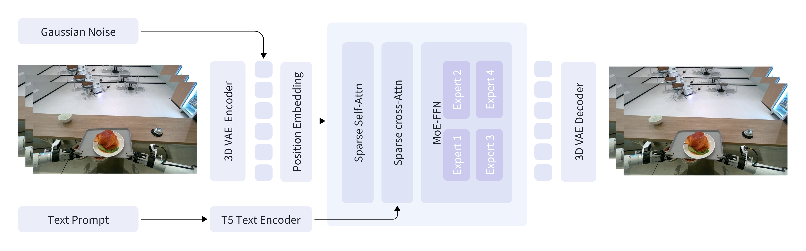

<div align="center" style="font-family: charter;">
    <h1> GigaWorld-0: World Models as Data Engine to Empower Embodied AI </h1>

[](https://opensource.org/licenses/Apache-2.0)
[](https://gigaworld0.github.io/)
[](https://arxiv.org/abs/2511.19861)
[](https://github.com/gigaworld0/gigaworld0.github.io/releases/download/v1/Gigaworld-0.mp4)
[](https://huggingface.co/open-gigaai)

</div>

## ✨ Introduction

World models are emerging as a foundational paradigm for scalable, data-efficient embodied AI. In
this work, we present GigaWorld-0, a unified world model framework designed explicitly as a data
engine for Vision-Language-Action (VLA) learning. GigaWorld-0 integrates two synergistic components:
GigaWorld-0-Video, which leverages large-scale video generation to produce diverse, texture-rich, and
temporally coherent embodied sequences under fine-grained control of appearance, camera viewpoint,
and action semantics; and GigaWorld-0-3D, which combines 3D generative modeling, 3D Gaussian
Splatting reconstruction, physically differentiable system identification, and executable motion planning
to ensure geometric consistency and physical realism.

## 🗺️ Architecture

GigaWorld-0-Video-Dreamer is our foundation video generation model, capable of achieving IT2V generation.



## ⚡ Installation

GigaWorld-0 depends on the following three frameworks:

- [GigaTrain](https://github.com/open-gigaai/giga-train): An Efficient and Scalable Training Framework for AI Models.
- [GigaDatasets](https://github.com/open-gigaai/giga-datasets): A Unified and Lightweight Framework for Data Curation, Evaluation and Visualization.
- [GigaModels](https://github.com/open-gigaai/giga-models): A Comprehensive Repository for Multi-modal, Generative, and Perceptual Models.

We recommend using a fresh conda environment for installation.

```bash
conda create -n giga_world_0 python=3.11.10 -y
conda activate giga_world_0

pip3 install giga-train
pip3 install giga-datasets
pip3 install natten

git clone https://github.com/open-gigaai/giga-models.git
cd giga-models
pip3 install -e .

git clone git@github.com:open-gigaai/giga-world-0.git
```

## 🚀 Quick Start

### 1. Download Models

| Models                        | Download Links                                                                     | Description                                                                                                                                              |
| ----------------------------- | ---------------------------------------------------------------------------------- | -------------------------------------------------------------------------------------------------------------------------------------------------------- |
| GigaWorld-0-Video-Pretrain-2b | 🤗 [Huggingface](https://huggingface.co/open-gigaai/GigaWorld-0-Video-Pretrain-2b) | 61x480x640, Image-text-to-video foundation model for embodied scenes.                                                                                    |
| GigaWorld-0-Video-GR1-2b      | 🤗 [Huggingface](https://huggingface.co/open-gigaai/GigaWorld-0-Video-GR1-2b)      | 93x480x768, Fine-tuning GigaWorld-0-Video-Pretrain-2b model with the [GR1 dataset](https://huggingface.co/datasets/nvidia/PhysicalAI-Robotics-GR00T-GR1) |

You can use the following script to download the models, including the text encoder and VAE:

```bash
python scripts/download.py --model-name video_pretrain --save-dir /path/to/giga_world_0_video_pretrain/
python scripts/download.py --model-name video_gr1 --save-dir /path/to/giga_world_0_video_gr1/
```

### 2. Data Preparation

Organize your video data with corresponding text prompts:

```
raw_data/
├── 0.mp4                # Video file 0
├── 0.txt                # Prompt for video file 0
├── 1.mp4                # Video file 1
├── 1.txt                # Prompt for video file 1
├── ...
```

Pack the data and extract prompt embeddings:

```bash
python scripts/pack_data.py \
  --video-dir /path/to/raw_data/ \
  --save-dir /path/to/packed_data/
```

### 3. Training

Before starting training, ensure your video data is packed and prompt embeddings are extracted as shown in the previous steps.

```
python scripts/train.py --config configs.giga_world_0_video.config
```

LoRA Training: Set `config.train_mode.train_mode='lora'` and `config.train_mode.lora_rank=64`, then run the command above.

### 4. Inference

Below are example commands for running inference with GigaWorld-0-Video. You can generate videos from text prompts using either a single GPU, multiple GPUs, or with LoRA fine-tuned models. Adjust the paths and GPU IDs according to your setup.

**Single GPU Inference:**
Use this command to run inference on a single GPU. Replace the paths with your actual model and data locations.

```bash
python scripts/inference.py \
  --data-path /path/to/packed_test_data/ \
  --save-dir /path/to/vis_results/ \
  --transformer-model-path /path/to/your_transformer/ \
  --text-encoder-model-path /path/to/giga_world_0_video/text_encoder/ \
  --vae-model-path /path/to/giga_world_0/vae/ \
  --gpu_ids 0
```

**Multi-GPU Inference:**
For faster inference or larger batches, you can utilize multiple GPUs by specifying their IDs.

```bash
python scripts/inference.py \
  --data-path /path/to/packed_test_data/ \
  --save-dir /path/to/vis_results/ \
  --transformer-model-path /path/to/your_transformer/ \
  --text-encoder-model-path /path/to/giga_world_0_video/text_encoder/ \
  --vae-model-path /path/to/giga_world_0_video/vae/ \
  --gpu_ids 0 1 2 3 4 5 6 7
```

**LoRA Inference:**
If you have fine-tuned the model using LoRA, include the `--lora-model-path` argument to load your LoRA weights.

```bash
python scripts/inference.py \
  --data-path /path/to/packed_test_data/ \
  --save-dir /path/to/vis_results/ \
  --transformer-model-path /path/to/giga_world_0_video/transformer/ \
  --text-encoder-model-path /path/to/giga_world_0_video/text_encoder/ \
  --vae-model-path /path/to/giga_world_0_video/vae/ \
  --lora-model-path /path/to/your_lora/ \
  --gpu_ids 0
```

After running inference, the generated videos will be saved in the directory specified by `--save-dir`.

## 📖 Citation

If you use GigaWorld-0 in your research, please cite:

```bibtex
@misc{gigaai2025gigaworld0,
      title={GigaWorld-0: World Models as Data Engine to Empower Embodied AI},
      author={GigaAI},
      year={2025},
      eprint={2511.19861},
      archivePrefix={arXiv},
      primaryClass={cs.CV},
      url={https://arxiv.org/abs/2511.19861},
}
```
